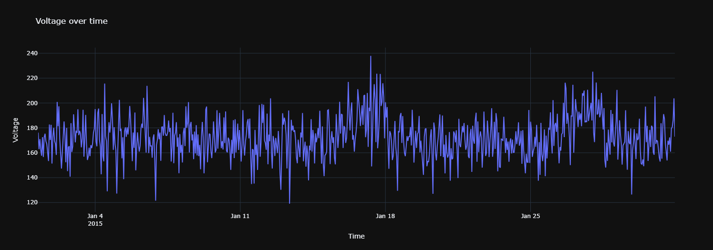
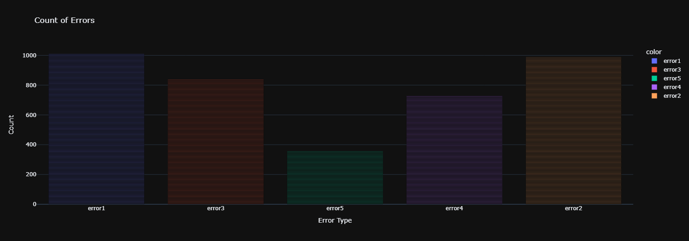
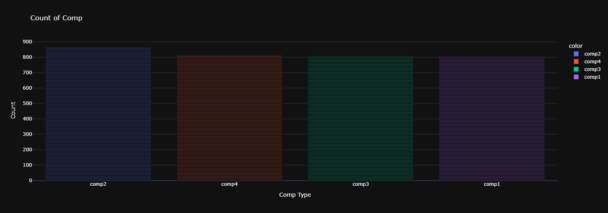
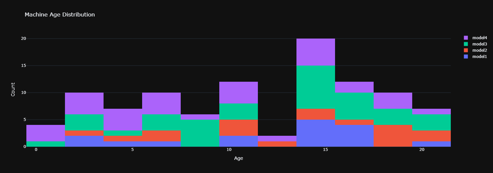
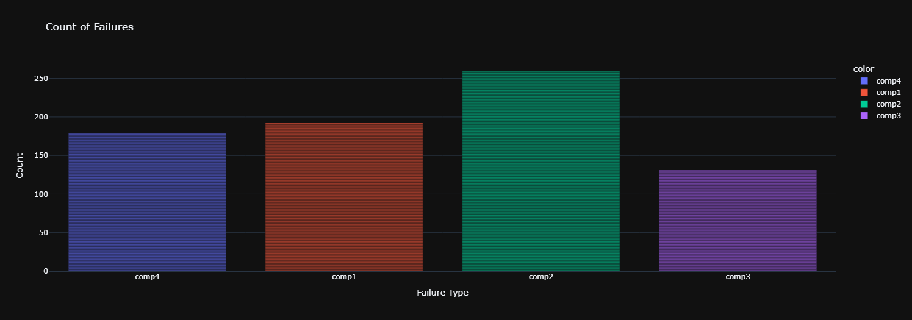

---

# **Predictive Maintenance Project**

## **Overview**
This project focuses on developing a predictive maintenance system that leverages machine learning to predict equipment failures. By analyzing telemetry, error logs, maintenance records, and failure history, the system provides actionable insights to reduce downtime and optimize operational efficiency.

---

## **Table of Contents**
1. [Project Structure](#project-structure)
2. [Datasets](#datasets)
3. [Setup Instructions](#setup-instructions)
4. [Exploratory Data Analysis (EDA)](#exploratory-data-analysis-eda)
5. [Model Training and Evaluation](#model-training-and-evaluation)
6. [Prediction and Inference](#prediction-and-inference)
7. [Results](#results)
8. [Future Work](#future-work)
9. [Acknowledgments](#acknowledgments)

---

## **Project Structure**

```
predictive-maintenance/
├── config/
│   ├── __init__.py              # Config initialization file
│   └── settings.py              # Configuration settings
├── data/
│   ├── __init__.py              # Data module initialization
│   ├── data_loader.py           # Data loading functions
│   ├── preprocessing.py         # Data preprocessing
│   ├── feature_engineering.py   # Feature extraction
│   ├── split.py                 # Train-test splitting
│   └── data_utils.py            # Additional utilities
├── exploration/
│   ├── __init__.py              # EDA module initialization
│   └── eda.py                   # Exploratory Data Analysis
├── modeling/
│   ├── __init__.py              # Modeling module initialization
│   ├── model.py                 # Model training
│   ├── hyperparameter_tuning.py # Hyperparameter optimization
│   ├── model_evaluation.py      # Model evaluation
│   └── explainability.py        # Model explainability
├── scripts/
│   ├── __init__.py              # Scripts module initialization
│   ├── train.py                 # Training script
│   ├── predict.py               # Inference script
│   └── test.py                  # Testing script
├── models/                      # Trained models and metadata
├── requirements.txt             # Python dependencies
├── README.md                    # Project documentation
└── .gitignore                   # Git ignore file
```

---

## **Datasets**

### **Description**
The project utilizes five datasets:
1. **Telemetry**: Sensor data from machines over time.
2. **Errors**: Logs of errors encountered by machines.
3. **Maintenance**: Historical records of maintenance activities.
4. **Failures**: Equipment failure history with timestamps.
5. **Machines**: Metadata about each machine (e.g., model, age).

### **Storage**
All datasets are stored in the `data/files/` directory.

---

## **Setup Instructions**

### **Prerequisites**
- Python 3.8+
- Virtual environment tools (e.g., `venv` or `conda`)

### **Steps**
1. Clone the repository:
   ```bash
   git clone https://github.com/HarshavardhanKurtkoti/ANAI.git
   cd ANAI
   ```
2. Set up a virtual environment and install dependencies:
   ```bash
   python -m venv venv
   source venv/bin/activate  # On Windows: venv\Scripts\activate
   pip install -r requirements.txt
   ```
3. Ensure data files are in the `data/files/` directory.

4. Run the training pipeline:
   ```bash
   python scripts/train.py
   ```

5. Make predictions:
   ```bash
   python scripts/predict.py
   ```

---

## **Exploratory Data Analysis (EDA)**

### **Overview**
EDA helps uncover patterns, trends, and anomalies in the data. This step is crucial for understanding the datasets and engineering features effectively.

### **Visualizations**

1. **Voltage Over Time**  
   This plot visualizes the voltage readings over time, helping to detect any fluctuations or trends in the system.  
   

2. **Count of Errors**  
   This bar chart shows the frequency of different error types, providing insight into the most common errors.  
   

3. **Count of Components (Comp)**  
   This plot displays the distribution of different machine components that have encountered failures or maintenance activities.  
   

4. **Machine Age Distribution**  
   This histogram shows the distribution of machine ages, helping to understand how age impacts failure rates.  
   

5. **Count of Failures**  
   This graph visualizes the frequency of failures for each machine type, helping to understand failure patterns.  
   

### **Steps for EDA**
Run the EDA script:
```bash
python exploration/eda.py
```
Generated visualizations are stored in `data/eda_images/`.

---

## **Model Training and Evaluation**

### **Model Pipeline**
1. **Preprocessing**: Handles missing values, scaling, and encoding.
2. **Feature Engineering**: Generates statistical and time-based features.
3. **Model Training**: Implements supervised machine learning classifiers.

### **Model Comparison**

| **Model**                     | **Accuracy (%)** | **Cross-Validated Accuracy (%)** | **Details**                                                                 |
|-------------------------------|------------------|-----------------------------------|-----------------------------------------------------------------------------|
| **XGBoost Classifier**        | **99.92**        | **99.91**                        | `XGBClassifier(base_score=0.5, booster='gbtree', ...)`                      |
| **CatBoost Classifier**       | 99.90            | 99.88                            | `<catboost.core.CatBoostClassifier object at 0x...>`                        |
| **Random Forest Classifier**  | 99.89            | 99.86                            | `(DecisionTreeClassifier(max_features='auto', random_state=...)`           |
| **Gradient Boosting Classifier** | 99.79          | 99.63                            | `[DecisionTreeRegressor(criterion='friedman_mse', ...]`                     |
| **LightGBM Classifier**       | 96.82            | 97.88                            | `LGBMClassifier()`                                                         |

### **Selected Model**
The **XGBoost Classifier** was chosen for deployment due to its superior accuracy and consistent cross-validation results.

---

## **Prediction and Inference**

### **Run Predictions**
```bash
python scripts/predict.py --input data/new_data.csv
```
The predictions are saved in `output/predictions.csv`.

---

## **Results**

### **Performance Metrics**
- **Accuracy**: 99.92%
- **Precision**: 0.85
- **Recall**: 0.81
- **F1-Score**: 0.83
- **ROC-AUC**: 0.90

### **Key Insights**
1. Older machines and those with elevated temperature readings are at higher risk of failure.
2. Frequent maintenance activities correlate with lower failure rates.

---

## **Future Work**

1. **Enhance Model**:
   - Experiment with deep learning models (e.g., LSTMs for time-series).
   - Integrate additional telemetry data.
2. **Real-Time Deployment**:
   - Deploy the model on edge devices for live predictions.
3. **Explainability**:
   - Leverage SHAP or LIME for better interpretability.

---
